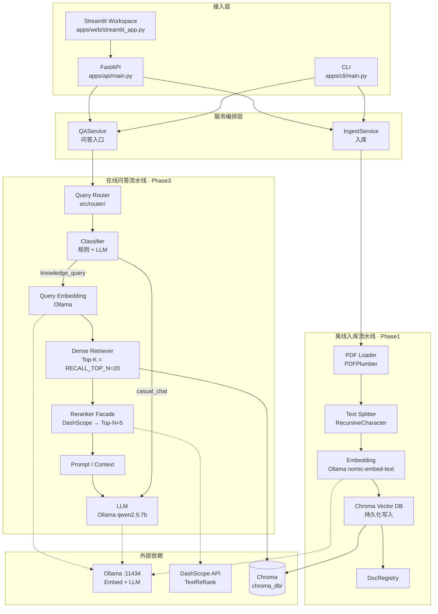
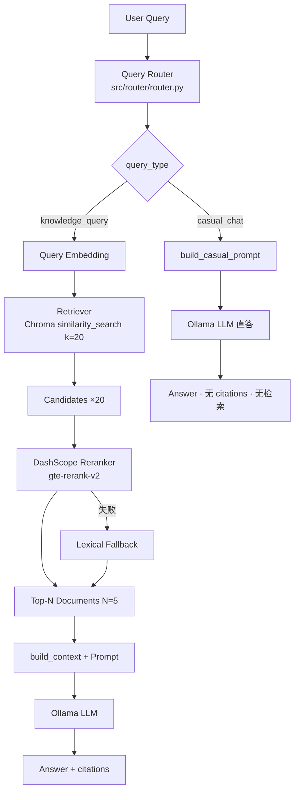
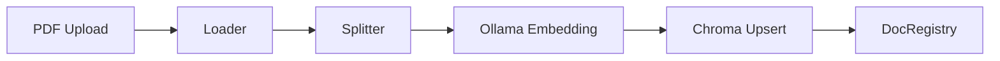
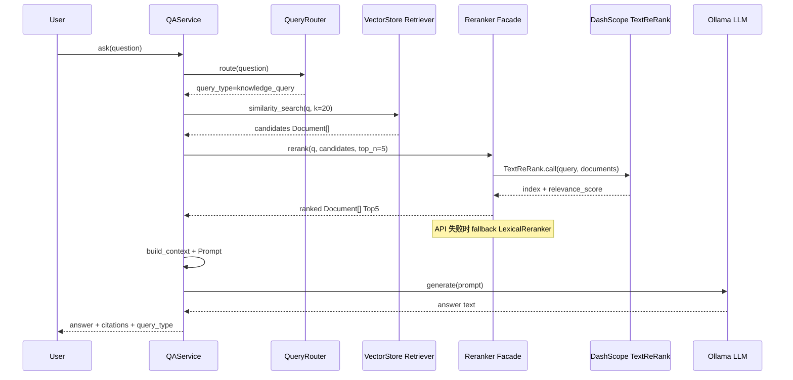
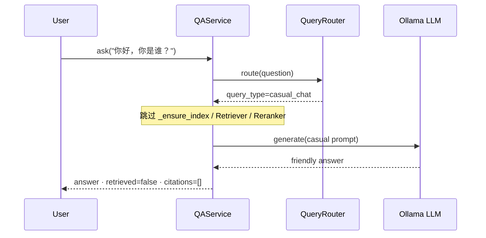

# Enterprise RAG — 最终架构图

> 基于当前实现：**Phase1–Phase5（RAG + Reranker + Query Router + 工程化 + Evaluation）**；Phase6 = Future Work  
> 默认在线链路：`User → FastAPI/Streamlit → Query Router → (Rewrite? → Dense[/Hybrid] → Reranker → Prompt → LLM) | (LLM 直答)`  
> 评测：[`docs/eval.md`](docs/eval.md) · 计划：[`docs/development_plan.md`](docs/development_plan.md) · Docker：[`docs/docker.md`](docs/docker.md)

---

## 0. 一句话架构

**本地 Ollama 负责 Embedding 与生成；Chroma 负责稠密召回；DashScope 负责语义重排；独立 Query Router 在入口按意图分流知识库链与闲聊链。**

---

## 1. 系统总览



---

## 2. 在线问答主链路（Phase3）



文本等价流程：

```text
User Query
  ↓
Query Router（规则优先，歧义时 LLM）
  ↓
判断 query_type
  ├── knowledge_query
  │     ↓
  │   Retriever（Top20）
  │     ↓
  │   Reranker（Top5）
  │     ↓
  │   Prompt
  │     ↓
  │   LLM
  │
  └── casual_chat
        ↓
      LLM 直接回答（跳过检索 / 重排）
```

---

## 3. 入库流水线（Phase1，未变）



```text
PDF
  → load_pdf (PDFPlumberLoader)
  → split_documents (RecursiveCharacterTextSplitter)
  → OllamaEmbeddings.embed_documents
  → Chroma.add_documents
  → DocRegistry 记录 doc_id
```

---

## 4. 时序：知识库问答



---

## 5. 时序：闲聊直答



---

## 6. 模块与文件映射

| 架构组件 | 实现位置 | 阶段 |
| --- | --- | --- |
| PDF Loader / Splitter | `src/ingestion/loaders.py`, `splitters.py` | Phase1 |
| Embedding | `src/indexing/embeddings.py` | Phase1 |
| Vector DB / Dense Retriever | `src/indexing/vectorstore.py` | Phase1 |
| Doc Registry | `src/indexing/doc_registry.py` | Phase1 |
| Ingest 编排 | `src/services/ingest_service.py` | Phase1 |
| **Query Router（意图）** | **`src/router/router.py`** | **Phase3** |
| **Query Classifier** | **`src/router/classifier.py`** | **Phase3** |
| Reranker Facade | `src/reranker/facade.py` | Phase2 |
| DashScope Reranker | `src/reranker/dashscope_reranker.py` | Phase2 |
| Lexical Fallback | `src/reranker/lexical.py` | Phase2 |
| Prompt / Casual Prompt | `src/generation/prompts/templates.py` | Phase1/3 |
| LLM Gateway | `src/generation/llm_gateway.py` | Phase1 |
| QA 编排（Router 入口） | `src/services/qa_service.py` | Phase1–3 |
| API | `apps/api/main.py` | Phase1（工程化主体属 Phase4） |
| 文档域路由骨架（非意图） | `src/retrieval/router.py` | 骨架，默认未作为主入口 |

> **命名注意**：`src/router/` = Phase3 **意图路由**；`src/retrieval/router.py` = 早期 **按文件名缩检索域** 骨架，二者不同。

---

## 7. 目录结构（当前）

```text
enterprise-rag/
├── apps/
│   ├── api/main.py              # FastAPI
│   ├── web/app.py               # Gradio 薄客户端
│   └── cli/main.py              # CLI
├── src/
│   ├── config/                  # Settings / 日志 / 代理绕过
│   ├── ingestion/               # Loader + Splitter
│   ├── indexing/                # Embedding + Chroma (+ BM25 骨架)
│   ├── router/                  # 【Phase3】Query Router + Classifier
│   ├── retrieval/               # dense / hybrid骨架 / 文档域 router 骨架
│   ├── reranker/                # 【Phase2】DashScope / CE / Lexical
│   ├── generation/              # Prompt / LLM / 后处理
│   ├── services/                # IngestService / QAService
│   └── eval/                    # 评测骨架（Phase5）
├── tests/
├── scripts/
├── docs/                        # progress / plan / decisions
├── data/samples/                # 样例 PDF
├── evaluation/                  # Reranker 对比产物
├── chroma_db/ · upload_cache/
├── RAG_ARCHITECTURE.md          # 本文件
├── README.md
└── requirements.txt
```

---

## 8. 关键配置（默认路径）

| 配置项 | 默认值 | 作用 |
| --- | --- | --- |
| `USE_QUERY_ROUTER` | `true` | 启用意图路由（Phase3） |
| `QUERY_ROUTER_MODE` | `rules_llm` | 规则优先，歧义走 LLM |
| `USE_RERANKER` | `true` | 启用重排（Phase2） |
| `RECALL_TOP_N` | `20` | Retriever 宽召回 |
| `TOP_K` | `5` | Rerank 后送入 LLM 的数量 |
| `RERANKER_BACKEND` | `dashscope` | 语义重排后端 |
| `DASHSCOPE_RERANK_MODEL` | `gte-rerank-v2` | DashScope 重排模型 |
| `EMBED_MODEL` | `nomic-embed-text` | 本地向量化 |
| `LLM_MODEL` | `qwen2.5:7b` | 本地生成 |
| `USE_BM25` / `USE_PDR` | `false` | 后续阶段能力，当前默认关闭 |

---

## 9. Phase 能力边界

| Phase | 状态 | 能力 |
| --- | --- | --- |
| Phase1 | 完成 | PDF → Split → Embed → Chroma → Dense → LLM |
| Phase2 | 完成 | Top20 → Reranker → Top5 → LLM |
| Phase3 | 完成 | Query Router → knowledge / casual 双链 |
| Phase4 | 未开始 | 工程化展示强化（README/Demo 等；API/Docker 文件已存在） |
| Phase5 | 未开始 | Recall / RAGAS 等系统化评测 |

当前**未实现**（有意不做）：Agent / Multi-Agent / Web Search / SQL Agent / 复杂 Evaluation 系统。
