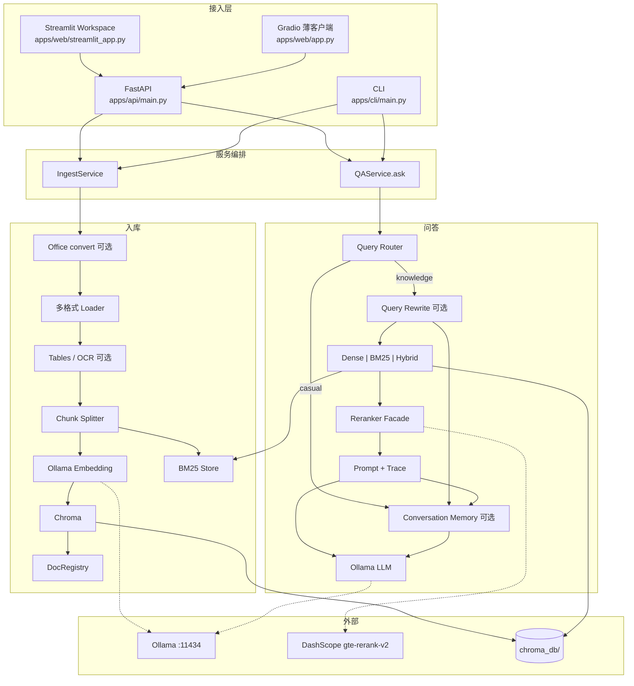
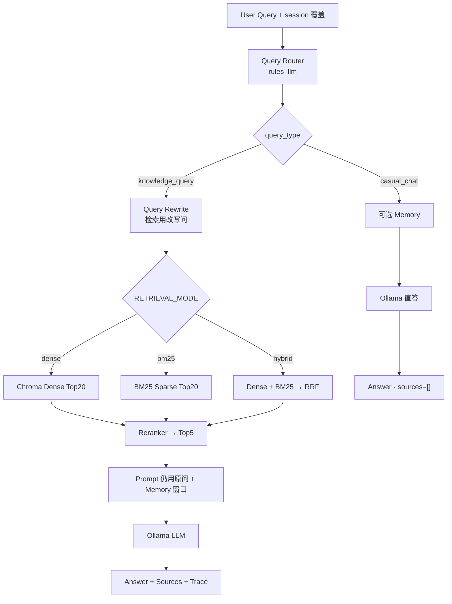
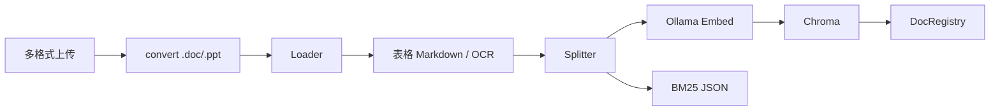
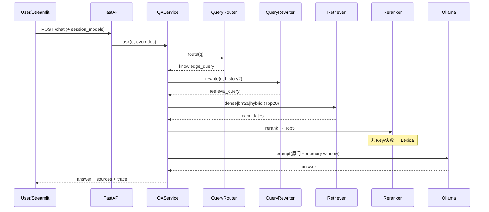
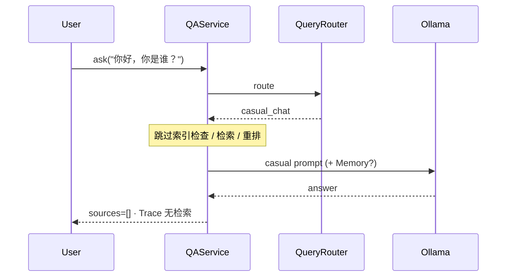

# Enterprise RAG — 架构图（与当前实现对齐）

> **状态：** Phase1–Phase4 + Enhancement Step1–Step4 完成 · Phase5 Evaluation 完成 · **Phase6（云 LLM/Embed + Session API Key）= Future Work**  
> **默认在线链路：**  
> `User → FastAPI / Streamlit → Query Router → (Rewrite? → Dense|BM25|Hybrid → Rerank → Prompt(原问+Memory?) → LLM) | (LLM 直答)`  
> **文档：** [`docs/eval.md`](docs/eval.md) · [`docs/docker.md`](docs/docker.md) · [`docs/demo_script.md`](docs/demo_script.md) · [`docs/development_plan.md`](docs/development_plan.md)

---

## 0. 一句话架构

**本地 Ollama 负责 Embedding 与生成；Chroma 做 Dense 近邻；可选 BM25 / Hybrid(RRF)；DashScope 做语义重排；Query Router 分流知识库与闲聊；Streamlit 提供可观测 Trace、Session 检索模式 / Memory / 模型覆盖。**

---

## 1. 系统总览



---

## 2. 在线问答主链路



```text
User Query（可带 session: retrieval_mode / Memory / 模型）
  ↓
Query Router（规则优先，歧义 LLM）
  ├── knowledge_query
  │     → Query Rewrite（可选；回答仍用原问）
  │     → Dense | BM25 | Hybrid(RRF)   ← Streamlit 可切换
  │     → Rerank Top5（默认 DashScope gte-rerank-v2）
  │     → Prompt(原问 + Memory?) → Ollama
  │     → Answer + Sources + Trace
  └── casual_chat
        → Ollama（跳过检索；可带 Memory）
```

**Session UI（不写 `.env`）：** 检索模式、开启 Memory、LLM/Embedding/Reranker backend。

---

## 3. 入库流水线



```text
pdf/doc/docx/ppt/pptx/md/txt
  → [Office 显式转换]
  → Loader →（表序列化 / 可选 OCR）
  → RecursiveCharacterTextSplitter（CHUNK_SIZE=1000, OVERLAP=150）
  → Embedding → Chroma
  → 同步写入 BM25 store
  → DocRegistry
```

---

## 4. 时序：知识库问答



---

## 5. 时序：闲聊直答



---

## 6. 模块与文件映射

| 组件 | 路径 | 说明 |
| --- | --- | --- |
| 多格式 Loader / 表 / OCR | `src/ingestion/` | Step2 / 3.6 |
| Embedding / Chroma / BM25 / Registry | `src/indexing/` | Phase1 + Hybrid |
| 意图 Router | `src/router/` | Phase3 |
| Dense/BM25/Hybrid + RRF | `src/retrieval/hybrid.py` | `RETRIEVAL_MODE` |
| 文档域 router（未进主链） | `src/retrieval/router.py` | 骨架 |
| PDR（未进主链） | `src/retrieval/pdr.py` | 开关存在未接线 |
| Reranker | `src/reranker/` | dashscope / CE / lexical |
| Query Rewrite | `src/query_rewrite/` | Step3.5 |
| Memory | `src/memory/` | Step3；UI 可关 |
| Trace / Confidence | `src/generation/trace.py` | Step1 |
| Session 覆盖 | `src/config/session_models.py` | Step4 + 检索模式/Memory |
| QA / Ingest | `src/services/` | 编排 |
| Eval | `src/eval/` | Phase5 ragas_lite + Recall |
| API / Streamlit / CLI | `apps/` | Phase4+ |

> **命名：** `src/router/` = 意图路由；`src/retrieval/router.py` = 文件名缩域骨架（主路径 `doc_ids=None`）。

---

## 7. 目录结构（当前）

```text
enterprise-rag/
├── apps/
│   ├── api/main.py                 # FastAPI
│   ├── web/streamlit_app.py        # 主 UI（检索模式 / Memory / Trace）
│   ├── web/app.py                  # Gradio 薄客户端
│   └── cli/main.py                 # ingest-dir / eval / compare
├── src/
│   ├── config/ · ingestion/ · indexing/
│   ├── router/ · query_rewrite/ · memory/
│   ├── retrieval/ · reranker/
│   ├── generation/ · services/ · eval/
├── data/samples/ · data/eval/
├── evaluation/                     # phase5_report · reranker_compare
├── docs/demo/                      # README 截图
├── RAG_ARCHITECTURE.md · README.md
└── requirements.txt
```

---

## 8. 关键配置（默认）

| 配置项 | 默认 | 作用 |
| --- | --- | --- |
| `USE_QUERY_ROUTER` | `true` | 意图路由 |
| `QUERY_ROUTER_MODE` | `rules_llm` | 规则 + LLM |
| `USE_QUERY_REWRITE` | `true` | 检索问改写 |
| `RETRIEVAL_MODE` | 空 | `dense`\|`bm25`\|`hybrid`；空则由 `USE_BM25` 推导 |
| `USE_BM25` | `false` | 兼容：true → 视为 hybrid |
| `USE_RERANKER` | `true` | 重排 |
| `RECALL_TOP_N` / `TOP_K` | `20` / `5` | 宽召回 / 精排截断 |
| `RERANKER_BACKEND` | `dashscope` | 语义重排 |
| `DASHSCOPE_RERANK_MODEL` | `gte-rerank-v2` | 重排模型 |
| `USE_CONVERSATION_MEMORY` | `true` | 多轮 Memory（UI 可关） |
| `EMBED_MODEL` / `LLM_MODEL` | `nomic-embed-text` / `qwen2.5:7b` | Ollama |
| `USE_PDR` | `false` | **未接入主链** |

模型/端口总表见 [`README.md` §3.1](README.md#31-各阶段模型与算法一览)。

---

## 9. Phase 能力边界

| Phase / Step | 状态 | 能力 |
| --- | --- | --- |
| Phase1 | 完成 | 入库 → Dense → LLM |
| Phase2 | 完成 | Top20 → Rerank → Top5 |
| Phase3 | 完成 | Query Router 双链 |
| Phase4 | 完成 | FastAPI + Streamlit + Docker |
| Enhancement 1–4 | 完成 | Trace / 多格式 / Memory / Rewrite / Hybrid / OCR / Session 模型 |
| UI 检索模式 | 完成 | Dense / BM25 / Hybrid + Memory 开关 |
| Phase5 | 完成 | Recall@K + RAGAS-style；样例 Recall@5 ≈ 91.7% |
| Phase6 | Future Work | 云 LLM/Embed + Session API Key |

**有意不做：** Agent / Web Search / SQL / 知识图谱。  
**对外不宣称：** PDR、文档域 router（代码可留、主路径未用）。
