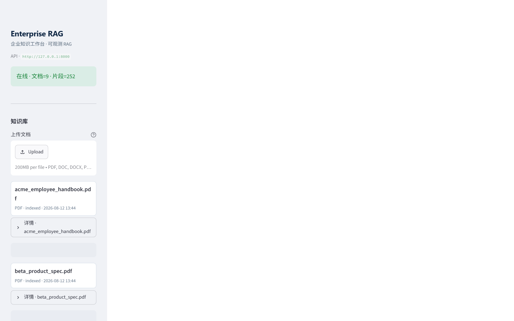
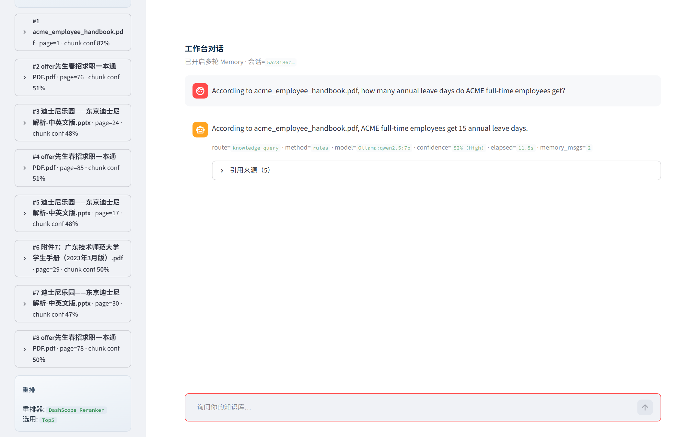
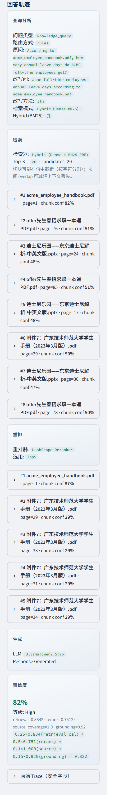
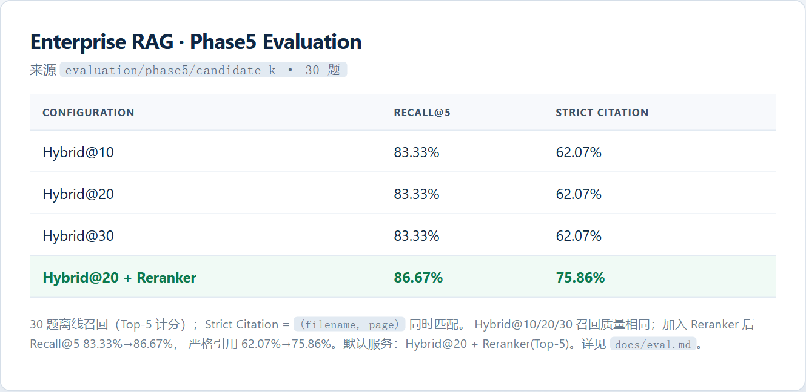

# Enterprise RAG

> 一句话：用本地 LLM + 向量检索，把企业内部文档变成可引用的智能问答服务。  
> One-liner: Turn private enterprise documents into citable Q&A with local LLM + vector retrieval.

**状态 / Status:** Phase1–Phase4 + Enhancement Step1–Step4 完成 · Phase5 Evaluation 完成 · 默认服务配置 **Hybrid@20 + Reranker(Top-5) + 本地生成** · [Future Work](#11-future-work)  
**架构图 / Architecture:** [`RAG_ARCHITECTURE.md`](RAG_ARCHITECTURE.md) · **评测 / Eval:** [`docs/eval.md`](docs/eval.md) · **Docker:** [`docs/docker.md`](docs/docker.md) · **演示:** [`docs/demo_script.md`](docs/demo_script.md)

---

## Index / 索引

| # | 中文 | English |
| --- | --- | --- |
| 1 | [项目介绍](#1-项目介绍) | [Overview](#1-overview-en) |
| 2 | [系统架构图](#2-系统架构图) | [Architecture](#2-architecture-en) |
| 3 | [技术栈](#3-技术栈)（含[模型与算法一览](#31-各阶段模型与算法一览)） | [Tech Stack](#3-tech-stack-en)（[models table](#31-models--algorithms-en)） |
| 4 | [功能展示](#4-功能展示) | [Features](#4-features-en) |
| 5 | [运行方式](#5-运行方式) | [Run](#5-run-en) |
| 6 | [项目结构](#6-项目结构说明) | [Layout](#6-layout-en) |
| 7 | [技术亮点](#7-技术亮点) | [Highlights](#7-highlights-en) |
| 8 | [API](#8-api) | [API](#8-api) |
| 9 | [配置](#9-配置管理) | [Config](#9-config-en) |
| 10 | [相关文档](#10-相关文档) | [Docs](#10-docs-en) |
| 11 | [Future Work](#11-future-work) | [Future Work](#11-future-work-en) |

---

# 中文

## 1. 项目介绍

企业知识分散在手册、规格书与 Office 文档中，通用聊天模型容易编造答案。  
**Enterprise RAG** 提供私有化路径：多格式上传 → 向量入库 → 意图路由 → Hybrid 检索 + 语义重排 → 本地 LLM 生成，并返回**引用来源**与 Answer Trace，便于演示、审计与作品集展示。

**默认服务配置（Phase5 定稿）：**

| 环节 | 默认 |
| --- | --- |
| Hybrid Retrieval | `candidate_k` / `RECALL_TOP_N` = **20** |
| Reranker | `TOP_K` = **5**（`USE_RERANKER=true`） |
| Generation | **开启**（Ollama 本地生成答案与引用） |

### Retrieval Evaluation

30 题离线召回评测（Top-5 计分；Strict Citation = `(filename, page)` 同时匹配）。完整说明见 [`docs/eval.md`](docs/eval.md)。

| Configuration | Recall@5 | Strict Citation |
| --- | --- | --- |
| Hybrid@10 | 83.33% | 62.07% |
| Hybrid@20 | 83.33% | 62.07% |
| Hybrid@30 | 83.33% | 62.07% |
| Hybrid@20 + Reranker | **86.67%** | **75.86%** |

将 Hybrid 召回候选从 10 扩到 30，并未提升 Top-5 检索质量；加入 Reranker 后，Recall@5 从 83.33% 提升至 86.67%，严格引用命中率（filename + page）从 62.07% 提升至 75.86%。

后续方向见下文 [Future Work](#11-future-work)。

## 2. 系统架构图

```text
User
  ↓
Query Router（规则 + LLM）
  ├── knowledge_query
  │     ↓
  │   Query Rewrite（可选）
  │     → Dense | BM25 | Hybrid(RRF)   ← Streamlit Session 可切换
  │     → Reranker → Prompt(原问 + Memory?) → Ollama
  │     → Answer + Sources + Trace
  └── casual_chat
        ↓
      Ollama（跳过检索；Memory 可关）
```

入库：

```text
多格式文件 → [Office 转换] → Loader →（表格 Markdown / 可选 OCR）→ Chunk → Embedding → Chroma + BM25
```

完整 Mermaid 图见 [`RAG_ARCHITECTURE.md`](RAG_ARCHITECTURE.md)。

## 3. 技术栈

| 层级 | 技术 |
| --- | --- |
| 编排 / RAG | LangChain |
| 本地 LLM / Embedding | Ollama（如 `qwen2.5:7b` / `nomic-embed-text`） |
| 向量库 | Chroma |
| 语义重排 | DashScope `gte-rerank-v2`（失败回退 Lexical） |
| API | FastAPI |
| Demo UI | Streamlit（另保留 Gradio 薄客户端） |
| 配置 | `.env` + pydantic-settings |
| 部署 | Docker / docker-compose |
| 评测 | CLI Recall@K + RAGAS-style 轻量指标 |

### 3.1 各阶段模型与算法一览

默认值以 `.env.example` 为准；Docker 下 Ollama 常经 `host.docker.internal:11434`，UI 经 `http://api:8000`。

| 阶段 | 角色 | 模型 / 算法 | Host | Port | URL / 接入 |
| --- | --- | --- | --- | --- | --- |
| 生成 | 回答、闲聊 | Ollama **`qwen2.5:7b`**（`LLM_MODEL`）；`LLM_TEMPERATURE=0.1` | `127.0.0.1` | `11434` | `http://127.0.0.1:11434`（`OLLAMA_BASE_URL`） |
| 意图路由 | 歧义时 LLM 分类 | 同上 Ollama LLM（规则优先，`QUERY_ROUTER_MODE=rules_llm`） | `127.0.0.1` | `11434` | 同上 |
| Query Rewrite | 检索问改写（可选） | 同上 Ollama LLM（`QUERY_REWRITE_MODE=rules_llm`）；失败回退记忆拼接 | `127.0.0.1` | `11434` | 同上 |
| Embedding | Dense 入库 + 近邻召回 | Ollama **`nomic-embed-text`**（`EMBED_MODEL`） | `127.0.0.1` | `11434` | 同上 |
| 向量库 | Dense 近邻存储 | **Chroma**（`VECTOR_DB_PATH=./chroma_db`）；distance→`1/(1+d)` 映射 Trace | 进程内 | — | 本地目录，无独立 HTTP |
| 稀疏检索 | BM25 / Hybrid | **BM25Okapi** + RRF；`RETRIEVAL_MODE=dense\|bm25\|hybrid`（空则由 `USE_BM25` 推导；UI 可切换） | 本地文件 | — | `BM25_STORE_PATH` |
| 语义重排 | 默认精排 | DashScope **`gte-rerank-v2`**（`DASHSCOPE_RERANK_MODEL`） | 云端 | — | DashScope API + `DASHSCOPE_API_KEY` |
| 本地重排 | 备选 | CrossEncoder **`BAAI/bge-reranker-base`**（`RERANKER_MODEL`，Hugging Face） | 本机 | — | `RERANKER_BACKEND=cross_encoder` |
| 回退重排 | Key/API 失败 | **Lexical** 词重叠打分 | 进程内 | — | `RERANKER_BACKEND=lexical` 或自动 fallback |
| 切块 | 入库 | `RecursiveCharacterTextSplitter`（`CHUNK_SIZE=1000`，`CHUNK_OVERLAP=150`） | 进程内 | — | — |
| OCR（可选） | 低文本页 | 系统 **Tesseract** + pytesseract（`OCR_LANG=chi_sim+eng`） | 本机 | — | — |
| 产品 API | HTTP | FastAPI | `127.0.0.1` | `8000` | `http://127.0.0.1:8000`（`API_BASE_URL`） |
| 主 UI | Demo | Streamlit Knowledge Workspace | `127.0.0.1` | `8501` | `http://127.0.0.1:8501` |
| 薄客户端 | 非主路径 | Gradio | `127.0.0.1` | `7860` | `http://127.0.0.1:7860` |

**检索口径简述：** 默认 **`RETRIEVAL_MODE=hybrid`**：Dense + BM25 → RRF，宽召回 `RECALL_TOP_N=20` → Rerank 截断 `TOP_K=5` → **LLM 生成**。UI 仍可 Session 切换 Dense / BM25 / Hybrid。BM25 **不是** Embedding 模型。

## 4. 功能展示

1. **多格式上传**：pdf / doc(x) / ppt(x) / md / txt；侧栏上传区独立于知识库列表（列表默认折叠）  
2. **智能问答**：Query Router 分流知识库 / 闲聊；可选 Query Rewrite（Session 可关）  
3. **检索模式（Session）**：Dense / BM25 / Hybrid，侧栏切换，不写 `.env`  
4. **引用来源 + Trace**：sources、置信度、原问/改写问、检索模式  
5. **Conversation Memory**：多轮窗口；侧栏可开关；Clear chat 开新会话  
6. **Session 模型覆盖**：LLM / Embedding / Reranker backend 仅当前浏览器会话  
7. **侧栏体验**：健康检查 / 文档列表短缓存 + 手动刷新；`.streamlit/config.toml` 关闭文件热重载以减轻重载噪音  
8. **评测**：`python -m apps.cli.main eval`（见 [`docs/eval.md`](docs/eval.md)）

### Demo 截图

| 场景 | 截图 |
| --- | --- |
| 知识库上传 / 已索引文档 |  |
| 问答 + 引用来源 |  |
| Answer Trace / 置信度 |  |
| Phase5 评测摘要 |  |

演示口述见 [`docs/demo_script.md`](docs/demo_script.md)。重截图（需本机 API+UI 已启动）：`python scripts/capture_demo_screenshots.py`（依赖可选 `playwright`）。

## 5. 运行方式

### 5.1 环境准备

```bash
cd enterprise-rag
python -m venv .venv
.venv\Scripts\activate          # Windows
# source .venv/bin/activate     # macOS / Linux
pip install -r requirements.txt
copy .env.example .env          # 按需填写 DASHSCOPE_API_KEY
```

安装并拉取 Ollama 模型（**本机运行，推荐**）：

```bash
ollama pull qwen2.5:7b
ollama pull nomic-embed-text
```

可选样例文档入库（仓库已含中文样例时可直接）：

```bash
python -m apps.cli.main ingest-dir data/samples
```

### 5.2 启动 API

```bash
uvicorn apps.api.main:app --host 127.0.0.1 --port 8000
```

健康检查：`http://127.0.0.1:8000/health`

### 5.3 启动 Streamlit Demo

```bash
streamlit run apps/web/streamlit_app.py --server.port 8501
```

浏览器打开 `http://127.0.0.1:8501`。

### 5.4 Docker / 快速调用

见 [`docs/docker.md`](docs/docker.md)。评测见 [`docs/eval.md`](docs/eval.md)。

```bash
curl -X POST http://127.0.0.1:8000/chat ^
  -H "Content-Type: application/json" ^
  -d "{\"query\":\"奖学金设置了哪些种类？\"}"
```

（上传示例：将路径换成 `data/samples` 下实际存在的文件。）

## 6. 项目结构说明

```text
enterprise-rag/
├── apps/
│   ├── api/main.py              # FastAPI
│   ├── web/streamlit_app.py     # Knowledge Workspace UI
│   └── cli/main.py              # ingest-dir / eval / compare
├── src/
│   ├── router/ · query_rewrite/ · reranker/
│   ├── ingestion/ · indexing/ · memory/ · eval/
│   ├── generation/ · services/ · config/
├── data/eval/ · data/samples/
├── evaluation/                  # Phase5 报告输出
├── docs/
└── tests/
```

## 7. 技术亮点

- **默认管线定稿**：Hybrid@20 → Reranker Top-5 → 本地生成（可引用答案）  
- **Query Router**：知识库走检索链，闲聊直达 LLM  
- **检索三模式**：Dense / BM25 / Hybrid(RRF)，Session UI 可切换；服务默认 Hybrid  
- **公平评测**：同候选 A/B 消融 + candidate_k∈{10,20,30}；结论是加宽召回不抬 Top-5，Rerank 抬 Recall 与严格引用  
- **Rewrite + Memory**：换问法更稳；二者均可 Session 开关  
- **Trace / Session 模型**：可解释、会话级覆盖不落盘密钥  
- **本地优先**：生成与向量默认 Ollama；Docker 可只容器化 API/UI  

## 8. API

| 方法 | 路径 | 说明 |
| --- | --- | --- |
| GET | `/health` | 健康检查 |
| POST | `/upload` | 多格式上传入库 |
| POST | `/chat` | 问答（可带 conversation_id / session 模型字段） |
| GET/POST | `/session/models` | Session 模型默认值 / 绑定 Embedding |
| GET | `/documents` | 文档列表 |
| DELETE | `/documents/{doc_id}` | 删除文档 |
| POST | `/reset` | 清空索引 |
| POST | `/compare-retrieval` | 重排对比 |

## 9. 配置管理

全部通过 `.env` / 环境变量，由 `src/config/settings.py` 统一读取。  
**禁止**在业务代码中硬编码 API Key。Session UI **不会**把 Key 写回 `.env`。

**服务默认（与 Phase5 推荐一致）：**

| 变量 | 默认 | 含义 |
| --- | --- | --- |
| `RETRIEVAL_MODE` | `hybrid` | Dense + BM25 + RRF |
| `RECALL_TOP_N` | `20` | Hybrid 候选宽度 |
| `TOP_K` | `5` | Rerank / 生成上下文条数 |
| `USE_RERANKER` | `true` | 开启语义重排 |
| `USE_BM25` | `true` | Hybrid 所需稀疏索引 |

其他常用变量：`OLLAMA_BASE_URL`、`LLM_MODEL`、`EMBED_MODEL`、`DASHSCOPE_API_KEY`、`RERANKER_BACKEND`、`USE_CONVERSATION_MEMORY`、`USE_QUERY_REWRITE`、`ENABLE_OCR` 等（见 `.env.example`）。

## 10. 相关文档

- [`RAG_ARCHITECTURE.md`](RAG_ARCHITECTURE.md) — 架构图  
- [`docs/rag_pipeline_and_modules.md`](docs/rag_pipeline_and_modules.md) — Pipeline 与核心模块（理解 / 面试）  
- [`docs/eval.md`](docs/eval.md) — 评测操作  
- [`docs/docker.md`](docs/docker.md) — Docker / Ollama  
- [`docs/demo_script.md`](docs/demo_script.md) — 演示脚本  
- [`docs/architecture_decisions.md`](docs/architecture_decisions.md) — 架构决策（ADR）  
- [`docs/development_plan.md`](docs/development_plan.md) — 开发计划（含 Future Work）  

## 11. Future Work

1. **Phase6**：云端 LLM / Embedding + Session API Key（Clear chat 保留 Key；不写回 `.env`）  
2. **减少不同语言语料的回答差异**（中英 / 多语料一致性）  
3. **优化 Query 改写策略**，并将改写从 Memory 板块在产品叙事与 UI 上进一步独立  
4. **尝试使用并对比不同的 chunk 切分策略**  
5. **优化置信度的计算与展示**，使其更合理、更好解释  
6. **高级**：Agent / Multi-Agent / Web Search / SQL Agent / 知识图谱。

---

## 许可证

© 2026 [Bosx HUO](https://github.com/SomeH-Bosx)（[@SomeH-Bosx](https://github.com/SomeH-Bosx)）。保留所有权利。

本项目为个人作品集，未经授权请勿用于商业用途或再分发。

---

# English

## 1. Overview (EN)

Enterprise documents should not be answered by hallucinating chatbots.  
**Enterprise RAG** is a local-first service: multi-format ingest → route by intent → hybrid retrieve + rerank → generate with Ollama → return **citable sources** and an Answer Trace.

**Default serving config (Phase5):** Hybrid retrieval `candidate_k=20` → Reranker `top_k=5` → **generation on**.

### Retrieval Evaluation

Offline recall on 30 questions (Top-5 scoring; Strict Citation = matched `(filename, page)`). See [`docs/eval.md`](docs/eval.md).

| Configuration | Recall@5 | Strict Citation |
| --- | --- | --- |
| Hybrid@10 | 83.33% | 62.07% |
| Hybrid@20 | 83.33% | 62.07% |
| Hybrid@30 | 83.33% | 62.07% |
| Hybrid@20 + Reranker | **86.67%** | **75.86%** |

Increasing the hybrid retrieval candidate size from 10 to 30 did not improve Top-5 retrieval quality, while adding a reranker improved Recall@5 from 83.33% to 86.67% and strict citation hit rate from 62.07% to 75.86%.

**Status:** Phases 1–4 + Enhancement Steps 1–4 done · Phase5 Evaluation done · remaining items under [Future Work](#11-future-work-en).

## 2. Architecture (EN)

```text
User → Query Router
        → knowledge: Rewrite? → Dense|BM25|Hybrid(RRF) → Rerank → Prompt(original+Memory?) → Ollama
        → casual: Ollama (Memory optional)
```

Ingest: multi-format → convert → load → tables/OCR → chunk → embed → Chroma (+ BM25 store).  
Session UI can switch retrieval mode and toggle Memory / Rewrite (no `.env` write). Full Mermaid: [`RAG_ARCHITECTURE.md`](RAG_ARCHITECTURE.md).

## 3. Tech Stack (EN)

LangChain · Ollama · Chroma · DashScope Reranker · FastAPI · Streamlit · Docker · pydantic-settings · CLI eval

### 3.1 Models & algorithms (EN)

Defaults from `.env.example`. Docker often uses `host.docker.internal:11434` for Ollama and `http://api:8000` for the UI.

| Stage | Role | Model / algorithm | Host | Port | URL / access |
| --- | --- | --- | --- | --- | --- |
| Generation | Answer / casual | Ollama **`qwen2.5:7b`** (`LLM_MODEL`); `LLM_TEMPERATURE=0.1` | `127.0.0.1` | `11434` | `http://127.0.0.1:11434` (`OLLAMA_BASE_URL`) |
| Intent router | LLM on ambiguous queries | Same Ollama LLM (rules first, `QUERY_ROUTER_MODE=rules_llm`) | `127.0.0.1` | `11434` | same |
| Query rewrite | Retrieval query only (optional) | Same Ollama LLM; fallback = memory concat | `127.0.0.1` | `11434` | same |
| Embedding | Dense ingest + recall | Ollama **`nomic-embed-text`** (`EMBED_MODEL`) | `127.0.0.1` | `11434` | same |
| Vector DB | Dense ANN store | **Chroma** (`./chroma_db`); Trace maps distance → `1/(1+d)` | in-process | — | local path, no HTTP |
| Sparse retrieve | BM25 / Hybrid | **BM25Okapi** + RRF; `RETRIEVAL_MODE=dense\|bm25\|hybrid` (empty derives from `USE_BM25`; UI switchable) | local file | — | `BM25_STORE_PATH` |
| Semantic rerank | Default | DashScope **`gte-rerank-v2`** | cloud | — | DashScope API + `DASHSCOPE_API_KEY` |
| Local rerank | Optional | CrossEncoder **`BAAI/bge-reranker-base`** (Hugging Face) | local | — | `RERANKER_BACKEND=cross_encoder` |
| Fallback rerank | No key / API fail | **Lexical** overlap scorer | in-process | — | `lexical` or auto fallback |
| Chunking | Ingest | `RecursiveCharacterTextSplitter` (1000 / 150) | in-process | — | — |
| OCR (optional) | Low-text pages | **Tesseract** + pytesseract | local | — | — |
| Product API | HTTP | FastAPI | `127.0.0.1` | `8000` | `http://127.0.0.1:8000` |
| Primary UI | Demo | Streamlit | `127.0.0.1` | `8501` | `http://127.0.0.1:8501` |
| Thin client | Non-primary | Gradio | `127.0.0.1` | `7860` | `http://127.0.0.1:7860` |

**Retrieval in one line:** Default **`RETRIEVAL_MODE=hybrid`**: Dense + BM25 → RRF (`RECALL_TOP_N=20`) → Rerank (`TOP_K=5`) → LLM. Session UI can still switch Dense / BM25 / Hybrid. BM25 is **not** an embedding model.

## 4. Features (EN)

- Multi-format upload (pdf/doc/ppt/md/txt); upload controls sit outside the collapsible document list  
- Query Router; Memory + Rewrite session toggles; Dense/BM25/Hybrid retrieval; Reranker  
- Streamlit workspace: Trace, session model overrides + retrieval mode (no `.env` write); short health/docs cache  
- Evaluation: Recall@K + RAGAS-style metrics via CLI  

### Demo screenshots

| Scene | Screenshot |
| --- | --- |
| Knowledge upload / indexed docs |  |
| Q&A + sources |  |
| Answer Trace / confidence |  |
| Phase5 eval snapshot |  |

Walkthrough: [`docs/demo_script.md`](docs/demo_script.md). Re-capture: `python scripts/capture_demo_screenshots.py` (optional `playwright`).

## 5. Run (EN)

```bash
pip install -r requirements.txt
copy .env.example .env
ollama pull qwen2.5:7b && ollama pull nomic-embed-text
python -m apps.cli.main ingest-dir data/samples
uvicorn apps.api.main:app --host 127.0.0.1 --port 8000
streamlit run apps/web/streamlit_app.py
# eval:
python -m apps.cli.main eval
# or
docker compose up --build
```

Host Ollama is recommended; see [`docs/docker.md`](docs/docker.md).

## 6. Layout (EN)

`apps/` (API + Streamlit + CLI) · `src/router|query_rewrite|reranker|memory|eval|...` · `docs/` · `evaluation/` · `tests/`

## 7. Highlights (EN)

Default Hybrid@20 + Reranker Top-5 + local generation · fair Phase5 ablations (wider candidates do not lift Top-5; rerank does) · Dense/BM25/Hybrid session switch · Memory + Rewrite toggles · Trace · local-first Ollama

## 8. API

Same table as Chinese section. Chat: `{"query":"..."}` → `{"answer","sources",...}`. Optional `conversation_id`, `retrieval_mode`, `use_conversation_memory`, `use_query_rewrite`, and session model fields.

## 9. Config (EN)

All secrets/paths/models via `.env` — no hardcoding; UI session overrides are memory-only.

**Serving defaults:** `RETRIEVAL_MODE=hybrid`, `RECALL_TOP_N=20`, `TOP_K=5`, `USE_RERANKER=true`, `USE_BM25=true` (generation always on for `/chat`).

## 10. Docs (EN)

[`RAG_ARCHITECTURE.md`](RAG_ARCHITECTURE.md) · [`docs/rag_pipeline_and_modules.md`](docs/rag_pipeline_and_modules.md) · [`docs/eval.md`](docs/eval.md) · [`docs/docker.md`](docs/docker.md) · [`docs/demo_script.md`](docs/demo_script.md) · [`docs/architecture_decisions.md`](docs/architecture_decisions.md) · [`docs/development_plan.md`](docs/development_plan.md)

## 11. Future Work (EN)

1. **Phase6:** cloud LLM / Embedding + session API key (kept across Clear chat; never written to `.env`)  
2. **Reduce answer drift across languages / corpora**  
3. **Improve Query Rewrite strategy** and keep it product/UI-independent from Memory  
4. **Try and compare alternative chunking strategies**  
5. **Improve confidence scoring and presentation** so it is more calibrated and explainable  

## License
© 2026 [SomeH‑Bosx](https://github.com/SomeH-Bosx). All rights reserved.

 This is a personal portfolio; commercial use and redistribution are prohibited without permission.
